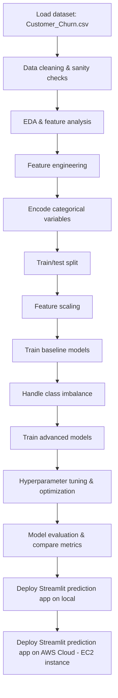

# Telecom Customer Churn Prediction

## Project Objective

This project is built to predict the likelihood of customer churn for a telecom company. The main business goal is to identify customers who are most at risk of leaving the service so that the company can take proactive retention actions like targeted offers, service improvements, or customer support outreach.

Churn prediction is critical because acquiring a new customer typically costs more than keeping an existing one. By modeling churn with customer account details, usage behavior, contract type, services chosen, and billing preferences, this project helps convert raw telecom data into actionable risk scores.

---

## What this project does

1. Loads and cleans the telecom churn dataset.
2. Performs exploratory data analysis (EDA) to understand churn drivers.
3. Engineers features that improve model performance, such as tenure buckets and dummy encoding for categorical variables.
4. Trains and evaluates multiple classification models.
5. Handles class imbalance using methods like SMOTE, SMOTEENN, ADASYN, and cost-sensitive learning.
6. Tunes the best models with randomized search and Optuna.
7. Deploys a Streamlit app for live churn prediction using a saved model locally and then on AWS EC2 instance.

---

## Workflow Diagram



This broader sequence reflects the progression used in the notebooks: from raw data through modeling and into deployment.

---

## Architecture and Tech Stack

- **Programming language:** Python 3.12+
- **Data processing:** `pandas`, `numpy`
- **Visualization & EDA:** `matplotlib`,`seaborn`
- **Machine learning:** `scikit-learn`(`DecisionTreeClassifier`, `RandomForestClassifier`, `AdaBoostClassifier`)
- **Gradient boosting:** `xgboost`, `lightgbm`, `catboost`
- **Imbalanced data handling:** `imbalanced-learn` (`SMOTE`, `SMOTEENN`, `ADASYN`)
- **Hyperparameter tuning:** `optuna`, `scikit-learn` `RandomizedSearchCV`
- **Model serialization:** `joblib`
- **Deployment:** `streamlit`,`AWS EC2`

---

## Notebook Summary

### 1. `Telco_Churn_Data_Cleaning_EDA.ipynb`
- Conducts dataset sanity checks and cleans the data.
- Converts `TotalCharges` to numeric and handles missing values.
- Creates tenure groups and performs univariate and bivariate analysis.
- Highlights churn risk factors such as:
  - Month-to-month contracts
  - Fiber optic internet service
  - No online security
  - No tech support
  - Paperless billing
  - Electronic check payment method
- Uses correlation-based feature insights and dummy variable expansion.

### 2. `ML_Model_Building_Telecom_Churn.ipynb`
- Prepares the data for machine learning by encoding categorical variables and scaling features.
- Splits the data into training and testing sets.
- Trains several models including decision tree, random forest, AdaBoost, and XGBoost.
- Evaluates the impact of feature scaling with `StandardScaler` and `MinMaxScaler`.
- Experiments with imbalance handling:
  - `SMOTE`
  - `SMOTEENN`
  - `ADASYN`
  - cost-sensitive learning with class weights and XGBoost `scale_pos_weight`
- Performs hyperparameter optimization using `RandomizedSearchCV` and `Optuna`.
- Compares models using metrics such as classification report and ROC-AUC.

---

## Deployment Notes

The Streamlit application is provided by `streamlit_app.py`. It loads data, rebuilds preprocessing steps, accepts user input, and predicts churn probability from a serialized model.

### Run locally

```bash
python -m streamlit run streamlit_app.py
```

> Note: The app expects a saved model file to be available for loading. Follow the notebook training flow or add a compatible serialized model file to run predictions successfully.

### Deployment guidance

`Deployment.txt` includes example commands for installing dependencies and running the Streamlit app in a live environment.

---

## Important Files

- `Customer_Churn.csv` — raw telecom churn dataset
- `Telco_Churn_Data_Cleaning_EDA.ipynb` — data cleaning, EDA, and feature engineering
- `ML_Model_Building_Telecom_Churn.ipynb` — model training, imbalance handling, and tuning
- `streamlit_app.py` — interactive deployment app for churn prediction
- `requirements.txt` — project dependencies
- `Deployment.txt` — deployment instructions

---

## Key Business Impact

This project helps telecom stakeholders answer the question: "Which customers are most likely to churn, and why?" By identifying churn drivers and building a predictive model, the company can reduce revenue loss and improve retention through targeted interventions.
