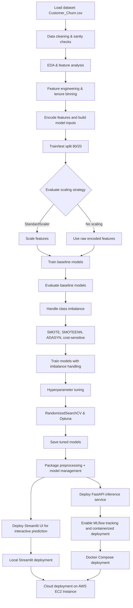

# Telecom Customer Churn Prediction

Here's the high level 6-phase project workflow


Here's the Streamlit UI that takes in user inputs (attributes of customer) and shows the probability of that customer churning:


## Project Objective

This project is built to predict the likelihood of customer churn for a telecom company. The main business goal is to identify customers who are most at risk of leaving the service so that the company can take proactive retention actions like targeted offers, service improvements, or customer support outreach.

Churn prediction is critical because acquiring a new customer typically costs more than keeping an existing one. By modeling churn with customer account details, usage behavior, contract type, services chosen, and billing preferences, this project helps convert raw telecom data into actionable risk scores.

---

## What this project does

1. **Data Cleaning & Preparation:** Loads the telecom churn dataset, handles missing values, converts data types, and creates tenure bins.
2. **Exploratory Data Analysis (EDA):** Identifies key churn drivers through univariate and bivariate analysis.
3. **Feature Engineering:** Applies label encoding to the target variable and one-hot encoding to categorical features.
4. **Train/Test Splitting:** Splits data into 80% training and 20% testing sets using stratified sampling.
5. **Baseline Model Training:** Tests multiple models (Decision Tree, Random Forest, Logistic Regression, XGBoost, AdaBoost) with and without feature scaling.
6. **Class Imbalance Handling:** Applies SMOTE, SMOTEENN, ADASYN, and cost-sensitive learning techniques.
7. **Hyperparameter Optimization:** Performs both RandomizedSearchCV and Optuna (Bayesian Optimization) to find best model parameters.
8. **Model Evaluation:** Compares models using F1-score, ROC-AUC, accuracy, and confusion matrices.
9. **Feature Importance Analysis:** Identifies the most influential features for churn prediction.
10. **Model Deployment:** Saves 4 tuned models and deploys a Streamlit app for interactive churn prediction locally and on AWS EC2.

---

## Workflow Diagram



This updated workflow captures both the notebook training process and the newer production architecture: package-based preprocessing, FastAPI inference, MLflow tracking, Docker Compose deployment, and AWS EC2 cloud deployment.

---

## Architecture and Tech Stack

- **Programming language:** Python 3.12+
- **Data processing:** `pandas`, `numpy`
- **Visualization & EDA:** `matplotlib`, `seaborn`
- **Machine learning:** `scikit-learn` (`DecisionTreeClassifier`, `RandomForestClassifier`, `AdaBoostClassifier`, `LogisticRegression`)
- **Gradient boosting:** `xgboost`, `lightgbm`, `catboost`
- **Imbalanced data handling:** `imbalanced-learn` (`SMOTE`, `SMOTEENN`, `ADASYN`)
- **Hyperparameter tuning:** `optuna` (Bayesian Optimization), `scikit-learn` `RandomizedSearchCV`
- **Model serialization:** `joblib`
- **API framework:** `fastapi`, `uvicorn`, `pydantic`
- **Experiment tracking:** `mlflow`
- **Deployment & containers:** `Docker`, `docker-compose`
- **Interactive UI:** `streamlit`
- **Testing:** `pytest`, `locust`
- **Logging:** Python `logging` with rotating file handlers

---

## Notebook Summary

### 1. `Telco_Churn_Data_Cleaning_EDA.ipynb`
- Conducts dataset sanity checks and cleans the data.
- Converts `TotalCharges` to numeric and handles missing values.
- Creates tenure groups and performs univariate and bivariate analysis.
- Highlights churn risk factors such as:
  - Month-to-month contracts
  - Fiber optic internet service
  - No online security
  - No tech support
  - Paperless billing
  - Electronic check payment method
- Uses correlation-based feature insights and dummy variable expansion.

### 2. `ML_Model_Building_Telecom_Churn.ipynb`
- **Data Preparation:**
  - Handles null values and converts `TotalCharges` to numeric format.
  - Creates tenure bins (1-12, 13-24, 25-36, 37-48, 49-60, 61-72 months) for better feature representation.
  - Applies label encoding to the target variable (`Churn`: Yes → 1, No → 0).
  - Uses one-hot encoding for categorical features.
  - Splits data into training (80%) and testing (20%) sets using `train_test_split`.

- **Feature Scaling & Preprocessing:**
  - Tests both `StandardScaler` and `MinMaxScaler`.
  - Applies scaling to prevent data leakage by fitting on training data only.

- **Model Training:**
  - Trains multiple baseline models: Decision Tree, Random Forest, Logistic Regression, XGBoost, and AdaBoost.
  - Tests models with and without feature scaling to evaluate impact.

- **Class Imbalance Handling:**
  - Compares multiple strategies: `SMOTE`, `SMOTEENN`, `ADASYN`, and cost-sensitive learning.
  - Uses class weights (`scale_pos_weight` for XGBoost, `class_weight` for Logistic Regression).
  - Identifies that SMOTE combined with Logistic Regression and StandardScaler achieves the best F1-score (0.61).

- **Hyperparameter Optimization:**
  - Uses `RandomizedSearchCV` with Stratified K-Fold validation (5 splits).
  - Applies `Optuna` (Bayesian Optimization) for advanced hyperparameter tuning with XGBoost.
  - Optimizes based on F1-score metric due to class imbalance.

- **Model Evaluation & Comparison:**
  - Compares F1-scores for the minority class (churn prediction) and overall accuracy across 5 tuned models.
  - Calculates ROC-AUC scores to differentiate between models with similar F1-scores.
  - Generates confusion matrices and ROC curves for visual interpretation.
  - **Top 3 Performing Models:**
    1. **Tuned XGBoost with StandardScaler and Optuna** – F1: 0.61, ROC-AUC: 0.73
    2. **Tuned XGBoost with StandardScaler (RandomizedSearchCV)** – F1: 0.61, ROC-AUC: 0.73
    3. **Tuned XGBoost with No Preprocessing** – F1: 0.61, ROC-AUC: 0.73

- **Feature Importance Analysis:**
  - Extracts feature importances from the Optuna-tuned XGBoost model.
  - Visualizes the most influential features for churn prediction.

- **Model Persistence:**
  - Saves 4 tuned models as joblib files for future deployment:
    - `tuned_xgb_no_preproc_model.joblib`
    - `tuned_xgb_standardscaler_model.joblib`
    - `tuned_xgb_smotenn_model.joblib`
    - `tuned_xgb_optuna_model.joblib`

---

## Model Performance Summary

After comprehensive experimentation with feature scaling, class imbalance techniques, and hyperparameter tuning, the following are the top-performing models:

| Model | F1-Score (Churn) | Overall Accuracy | ROC-AUC | Feature Scaling | Imbalance Handling |
|-------|------------------|------------------|---------|-----------------|-------------------|
| XGBoost + Optuna | 0.61 | 0.73 | 0.73 | StandardScaler | None |
| XGBoost + RandomizedSearchCV | 0.61 | 0.73 | 0.73 | StandardScaler | None |
| XGBoost (No Preprocessing) | 0.61 | 0.73 | 0.73 | None | Cost-Sensitive |
| Logistic Regression + SMOTE | 0.61 | 0.73 | 0.72 | StandardScaler | SMOTE |
| XGBoost + SMOTEENN | 0.60 | 0.73 | 0.71 | StandardScaler | SMOTEENN |

**Key Findings:**
- All top models achieve consistent F1-scores of 0.60-0.61 for churn prediction.
- Optuna (Bayesian Optimization) provides marginal improvements over RandomizedSearchCV.
- Feature scaling primarily benefits distance-based models like Logistic Regression.
- Tree-based models (XGBoost) are less sensitive to feature scaling but achieve similar performance.
- SMOTE and cost-sensitive learning both effectively handle class imbalance.

---

## Getting Started

1. Install dependencies:

```bash
pip install -r requirements.txt
```

2. Run the Streamlit UI locally:

```bash
python -m streamlit run streamlit_app.py
```

3. Run the FastAPI service locally:

```bash
uvicorn api:app --host 0.0.0.0 --port 8000
```

4. Start the complete containerized stack:

```bash
docker compose up --build
```

---

## Deployment Notes

The Streamlit application is provided by `streamlit_app.py`. It loads data, rebuilds preprocessing steps, accepts user input, and predicts churn probability from a serialized model.

### Run locally

```bash
python -m streamlit run streamlit_app.py
```

### API server

```bash
uvicorn api:app --host 0.0.0.0 --port 8000
```

### Start the complete stack with Docker Compose

```bash
docker compose up --build
```

> Note: The Docker Compose stack includes the prediction API, Streamlit UI, and an MLflow tracking server.

### Deployment guidance

`Deployment.txt` includes example commands for installing dependencies and running the Streamlit app in a live environment.

---

## Important Files

- `Customer_Churn.csv` — raw telecom churn dataset
- `Telco_Churn_Data_Cleaning_EDA.ipynb` — data cleaning, EDA, and feature engineering
- `ML_Model_Building_Telecom_Churn.ipynb` — model training, imbalance handling, and hyperparameter tuning with evaluation
- `streamlit_app.py` — interactive deployment app for churn prediction
- `api.py` — FastAPI server entrypoint for production inference
- `telecom_churn/` — package modules for preprocessing, model management, API, batch processing, MLflow, and logging
- `requirements.txt` — project dependencies
- `pyproject.toml` — project metadata
- `docker-compose.yml` — multi-service container orchestration
- `Dockerfile` — container image definition
- `pytest.ini` — pytest configuration
- `Deployment.txt` — deployment instructions
- `tests/` — unit tests for preprocessing, API payload validation, batch processing, and logging
- `load_tests/locustfile.py` — API load testing harness
- **Saved ML Models** (in `Saved ML models/` folder):
  - `tuned_xgb_no_preproc_model.joblib` — XGBoost tuned with RandomizedSearchCV (no preprocessing)
  - `tuned_xgb_standardscaler_model.joblib` — XGBoost tuned with RandomizedSearchCV (StandardScaler)
  - `tuned_xgb_smotenn_model.joblib` — XGBoost tuned with RandomizedSearchCV (StandardScaler + SMOTEENN)
  - `tuned_xgb_optuna_model.joblib` — XGBoost tuned with Optuna (Bayesian Optimization, StandardScaler)

---
## Production Architecture and Deployment

This repo now includes a production-grade multi-service architecture built using:

- `api.py` — FastAPI application entrypoint for model inference
- `telecom_churn/api.py` — API module with validation, error handling, and batch prediction
- `Dockerfile` and `docker-compose.yml` — containerized deployment with API, Streamlit UI, and MLflow tracking services
- `load_tests/locustfile.py` — load testing harness for the prediction endpoint
- `tests/` — unit tests for preprocessing, logging, batch batching, and request validation

### Run locally

```bash
python -m streamlit run streamlit_app.py
```

### API server

```bash
uvicorn api:app --host 0.0.0.0 --port 8000
```

### Start the complete stack with Docker Compose

```bash
docker compose up --build
```

### Run unit tests

```bash
pytest
```

---
## Key Business Impact

This project helps telecom stakeholders answer the question: "Which customers are most likely to churn, and why?" By identifying churn drivers and building a predictive model, the company can reduce revenue loss and improve retention through targeted interventions.
